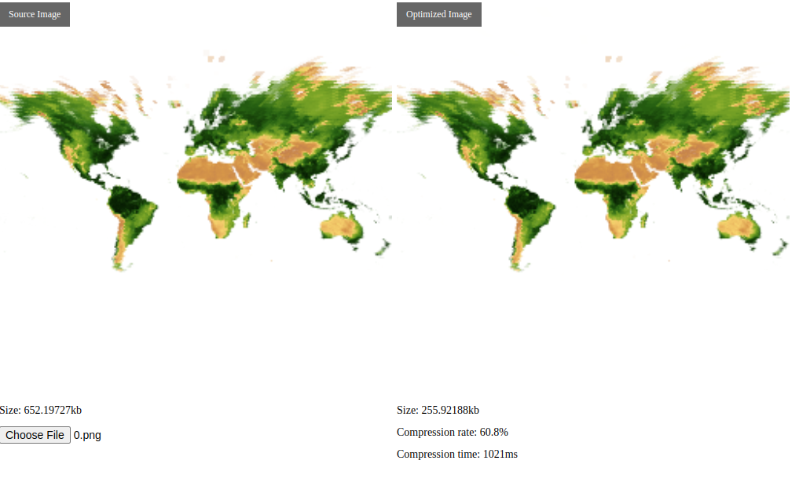

Redes
==============================


[Red.es](https://www.red.es/es) is a grant from the Ministerio De Asuntos Económicos Y Transformación Digital to carry out innovation in Vizzuality’s portfolio of Digital Content products and services.

# APNG-Optimizer
This is a tool to optimize APNG files. It uses [libimagequant](https://github.com/ImageOptim/libimagequant) and [APNG Optimizer](https://sourceforge.net/projects/apng/files/APNG_Optimizer/)

## Run the demo

```sh
yarn install && yarn demo
```



## Use it in your project

Before we get started, we need to configure our packaging tool (like webpack) to support loading WebAssembly:

```js
module.exports = {
    module: {
        rules: [{
            test: /\.wasm$/,
            use: [{
                loader: 'file-loader'
            }]
        }]
    }
}
```

```js
import { APNGOptimizer } from 'apng-optimizer';
import assemblyPath from 'apng-optimizer/dist/apng-optimizer.wasm';

APNGOptimizer.createOptimizer(assemblyPath)
    .then(optimizer => {
        // ... load your apng image as buffer
        const uint8Array = new Uint8Array(buffer);
        const optAPNGArray = optimizer.optAPNG(uint8Array, {

            minQuality: 0,
            maxQuality: 100,
            processCallback: function(progerss) {
                console.log(progress); // 0.1231111
            }
        });
        const blob = new Blob([optAPNGArray.buffer], { type: 'image/png' });
        const url = URL.createObjectURL(blob);
        img.src = url;
    });
```

## API

### APNGOptimizer.createOptimizer(modulePath: string): Promise<APNGOptimizer>

Create a new compressor instance by loading WebAssembly on the `modulePath` path.

### APNGOptimizer.#optAPNG(apngBuffer: Uint8Array, options?: OptimizerOptions): Uint8Array

compress apng images

+ apngBuffer: buffer data of apng image file
+ Optimization options:
  + deflateMethod(number): 0: zlib, 1: 7zip, 2: zopfli，Default `1`
  + iter(number): The number of iterations to use the compression algorithm, defaults to
 `15`
  + minQuality(number): `imagequant` Minimum quality for swatch picking, default is `0`
  + maxQuality(number): `imagequant` Maximum quality for swatch picking, default is `100`
  + disabledQuant(boolean): Disable `imagequant`, `minQuality` and `maxQuality` will have no effect when disabled
  + processCallback((progress: number) => void): Compression progress callback, `progress` is the current compression progress ( 0 ~ 1)
